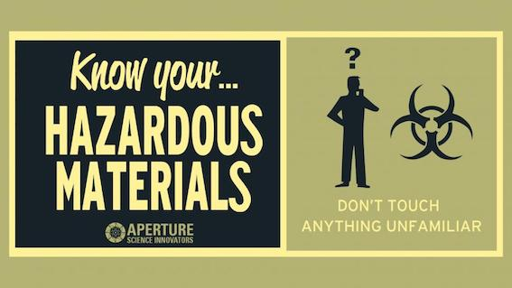

<html>
			<meta charset="utf-8"/>
			<link rel="stylesheet" href="style.css" />
	

	<body>
	

	<figure>
	
	</figure>
		
 Bienvenue sur ma page de présentation de..., et bien de moi même ! N'ai pas peur, tu entre en zone contanminé mais si tu prends tes précautions, tout devrait bien se passer. Enfiles ta combinaison de protection, ton masque et suis moi, je vais tenter de t'expliquer pourquoi je suis là ! 

		
	
	
		<h2>Qui je suis ?</h2>

	

	<a href="images/CV FL.pdf">Télécharger mon cv</a>

	Amoureuse des sciences depuis toujours et curieuse de comprendre comment fonctionnait le monde qui m'entoure, j'ai choisi un parcourt universitaire tourné vers le monde de l'infiniment petit. Ce monde, c'est l'infectiologie !        

	
	
	 
	
	<h2 class= "dessous">Ce que j'ai fait</h2>
	
	

	
	
		<h2> mon parcours pro</h2>

	
 Virus, bactéries, parasites, ils n'ont plus de secret pour moi. A travers mon parcours, j'ai cherché à comprendre comment ils évoluent, se multiplient et infectent un organisme vivant.

	<ul>
			<li>2006-2008 Doctorat de virologie à l'Institut de Recherche sur la Biologie de l'Insecte, Tours.</li>
			<li>2008-2013Doctorat de virologie à l'Institut de Recherche sur la Biologie de l'Insecte, Tours.</li>
			<li>2012-2013Attaché temporaire d'enseignement et recherche à l'université François Rabelais de Tours.</li>
			<li>2013-2016Chercheur Contractuel à l'Institut Pasteur, Paris.</li>
			
		</ul>
	

		

	<h2> Mon parcours citoyen </h2>
	
 Virus, bactéries, parasites, ils n'ont plus de secret pour moi. A travers mon parcours, j'ai cherché à comprendre comment ils évoluent, se multiplient et infectent un organisme vivant.

	<ul>
			<li>2006-2008 Doctorat de virologie à l'Institut de Recherche sur la Biologie de l'Insecte, Tours.</li>
			<li>2008-2013Doctorat de virologie à l'Institut de Recherche sur la Biologie de l'Insecte, Tours.</li>
			<li>2012-2013Attaché temporaire d'enseignement et recherche à l'université François Rabelais de Tours.</li>
			<li>2013-2016Chercheur Contractuel à l'Institut Pasteur, Paris.</li>
			
		</ul>
		

		

		
	
	
		<h2> Ce que je veux faire </h2>

	
 developpeuse web et blabla bla 

	
	

<footer>
		<h3 id="site_web_ancre"><em>le site de striduli c'est ici</em></h3>
<a href="https://striduli.wixsite.com/striduli" title= "ça déchire grave">STRIDULI</a>  
</footer>
	
	</body>
</html>
