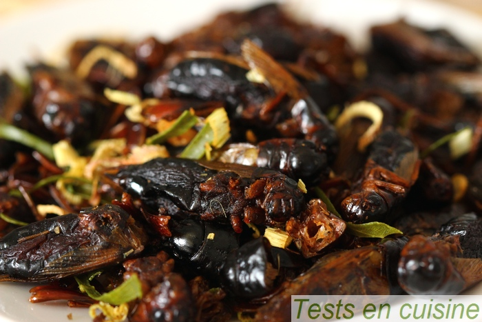

<html>
			<meta charset="utf-8"/>
			<link rel="stylesheet" href="style.css" />
	

	<body>
	
	
	
		<h2>Qui je suis ?</h2>
	

	
	
		<a href="#site_web_ancre">aller vers site web</a>
	

		 
		 
		
		<section>
            <aside>
                <h1>A propos de l'auteur</h1>
                
C'est moi, Zozor ! Je suis né un 23 novembre 2005.

            </aside>
            <article>                
                <h1>Je suis un grand voyageur</h1>
                
Bla bla bla bla (texte de l'article)

            </article>
        </section>
		
<section>	

	

	Amoureuse des sciences depuis toujours et curieuse de comprendre comment fonctionnait le monde qui m'entoure, j'ai choisi un parcourt universitaire tourné vers le monde de l'infiniment petit. Ce monde, c'est l'infectiologie !  

	

</section>	
		<aside>
	
	 <h3> si tu veux en savoir plus<h3>
	<figure>
			
		</figure>
			<figure>
		</figure>
			<figure>
		</figure>
	
	</aside>
<section>
		<h2 class="dessous">Ce que j'ai fait</h2> 

	

					
 Virus, bactéries, parasites, ils n'ont plus de secret pour moi. A travers mon parcours, j'ai cherché à comprendre comment ils évoluent, se multiplient et infectent un organisme vivant.
  

	
		
	<section>
	<ul>
			<li>2006-2008 Doctorat de virologie à l'Institut de Recherche sur la Biologie de l'Insecte, Tours.</li>
			<li>2008-2013Doctorat de virologie à l'Institut de Recherche sur la Biologie de l'Insecte, Tours.</li>
			<li>2012-2013Attaché temporaire d'enseignement et recherche à l'université François Rabelais de Tours.</li>
			<li>2013-2016Chercheur Contractuel à l'Institut Pasteur, Paris.</li>
			
		</ul>
		</section>
		
	<article>

<em>les premières étapes de la recette</em>

		
		<ol class="étapes">
			<li>Couper la tomate en dés</li>
			<li>Emincer finement le concombre et la moitié du poivron vert</li>
			<li>Hacher l'oignon</li>
			<li>bien mélanger</li>
		</ol>
		
 Disposer sur un plat les grillons arrosés de jus de citron. 
			Poivrer et laisser mariner 10 min au frigo. 
			Egoutter les grillons et arroser du jus du deuxième citron. 
		Ajouter les crudités et le lait de coco, le concombre, le sel. Mettre 1h au frais avant de servir.

	</article>
</section>
		
<section>
		<h2 class="dessous">Ce que je fais</h2> 

	

					
 <mark>Pour 4 personnes </mark>  
	

		<figure>
			
			<figcaption>grillons séchés</figcaption>
		</figure>
	<aside>		
	- **2006-2008** _Master d'infectiologie à l'université François Rabelais, Tours._
- **2008-2013** _Doctorat de virologie à l'Institut de Recherche sur la Biologie de l'Insecte, Tours._
- **2012-2013** _Attaché temporaire d'enseignement et recherche à l'université François Rabelais de Tours._
- **2013-2016** _Chercheur Contractuel à l'Institut Pasteur, Paris._

		<ul>
			<li>40 grillons</li>
			<li>20cl de lait de coco</li>
			<li>2 citrons</li>
			<li>1 petit oignon blanc</li>
			<li>1 tomate</li>
			<li>1 moitié de concombre</li>
			<li>1 moitié de poivron vert</li>
			<li>sel poivre</li>
		</ul>
	</aside>	
	

	<article>

<em>les premières étapes de la recette</em>

		
		<ol class="étapes">
			<li>Couper la tomate en dés</li>
			<li>Emincer finement le concombre et la moitié du poivron vert</li>
			<li>Hacher l'oignon</li>
			<li>bien mélanger</li>
		</ol>
		
 Disposer sur un plat les grillons arrosés de jus de citron. 
			Poivrer et laisser mariner 10 min au frigo. 
			Egoutter les grillons et arroser du jus du deuxième citron. 
		Ajouter les crudités et le lait de coco, le concombre, le sel. Mettre 1h au frais avant de servir.

	</article>
</section>
<nav>
<h3>pour cuisiner d'autres insectes, par ici </h3>
<a href="criquets panés.html"> <strong>autre recette</strong>  </a>
</nav>
<footer>
		<h3 id="site_web_ancre"><em>le site de striduli c'est ici</em></h3>
<a href="https://striduli.wixsite.com/striduli" title= "ça déchire grave">STRIDULI</a>  
</footer>
	</body>
</html>
