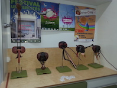

<html>
			<meta charset="utf-8"/>
			<link rel="stylesheet" href="style.css" />
	

<body>

<nav>
		<figure><a href="#parcours">  Mon parcours  </a></figure>
		<figure><a href="#moi">  A propos de moi  </a></figure>	
		<figure><a href="#titreprojet">  Mon projet  </a></figure>	
            	<figure><a href="images/CV FL.pdf" target="_blank">  Mon CV  </a></figure>
		<figure><a href="https://www.theses.fr/2013TOUR4037" target="_blank">  Ma thèse  </a></figure>
	 </nav>	

		
	
	<aside>
		

		
		  
		
		Les métiers du numérique font partis du secteur qui recrute le plus à l'heure actuelle.  
		Il représente une multitudes de métiers d'avenir dont celui de<strong> développeurs web</strong>.   
		C'est un métier passionnant, présentant beaucoup de similitudes avec mes activités précédentes.  
		Il est stimulant, évolue constamment, demande de la persévérance et permet de travailler n'importe où.   <em>C'est pourquoi j'ai fait le choix de me reconvertir dans ce domaine: mon objectif: c'est <strong> trouver un emploi qui me plaise </strong>et exercer un métier en évolution permanente.</em> 

	</aside>
	
	
	
	<h2 id="parcours">Mon parcours</h2>
	
	

	   
 <ul>
		<li>2003-2007  Bénévole association naturaliste NATRIX, Tours.</li>
		<li>2006-2008  Master d'Infectiologie<a href="https://sciences.univ-tours.fr/version-francaise/bienvenue-sur-le-site-de-la-faculte-de-sciences-et-techniques-159428.kjsp" target="_blank"> L'université des sciences et techniques</a>, Tours.</li>
		<li>2007-2008  Bénévole <a href="http://www2.cnrs.fr/jeunes/25.htm" target="_blank"> Club CNRS</a> Science pop', Tours.</li>
			<li>2008-2013  Doctorat de virologie à l'<a href="http://irbi.univ-tours.fr/" target="_blank"> Institut de Recherche sur la Biologie de l'Insecte</a>, Tours.</li>
			<li>2008-  Bénévole et administratrice de l'<a href="http://www.lespetitsdebrouillards.org/" target="_blank">Association les Petits Débrouillards</a>, Tours et Paris.</li>
			<li>2012-2013  Attaché temporaire d'enseignement et recherche à l'université de Tours.</li>
			<li>2013-2016  Chercheuse Contractuelle à l'<a href="https://www.pasteur.fr/fr" target="_blank"> Institut Pasteur</a>, Paris.</li>
			<li>2018  Créatrice de l'agence d'animation et de communication scientifique <a href="https://striduli.wixsite.com/striduli" target="_blank"> STRIDULI</a>, Tours.</li>
		</ul>

	

	
	
	
	    <h2 id="moi">A propos de moi</h2>
	    
	    
	

	   
          

		    

	
		  <em id="show">Je suis le docteur Faustine LOUIS, mais pas le genre de docteur qui soigne, plutôt celui qui s'interesse aux microbes qui te rendent malade. </em>   

		
		<h3>Mes recherches</h3>
		
		

		
<em>Passionnée par le monde de l'invisible, je me suis plongée dans les domaines de la génétique et de l'infectiologie.</em>  
 <strong>Ma thèse: </strong>Mon doctorat à Tours a été passionnant, demandant une grande capacité d'abstraction !  Mon job était de comprendre comment <em>un virus d'insecte </em>se développe dans les cellules d'une guêpe avant que celle-ci l'injecte avec ses oeufs dans une chenille.  
Ce virus génial empêche la chenille de tuer les larves de guêpe qui peuvent alors dévorer celle-ci de l'intérieur jusqu'à se transformer en guêpe (Alien a tout pomper sur ce modèle) ...  La nature est si belle !    

<strong>Mon postdoc: </strong>J'ai ensuite travailler 2 ans à l'<a href="https://www.pasteur.fr/" target="_blank">Institut Pasteur</a> de Paris sur <em>un virus de fièvre hémorragique </em>transmis par les moustiques, l'air et les fluides.  Là, j'avais la panoplie: combinaison de protection, masque, gants, lunettes et laboratoire sécurisé.  Je devais évaluer si les moustiques français peuvent transmettre ce virus Africain.  

		<h3>Mes loisirs</h3>

 
	Je suis très investie dans l'association <a href="http://www.lespetitsdebrouillards.org/" target="_blank">les petits débrouillards</a>, mouvement d'éducation populaire sensibilisant le grand public aux sciences.  C'est essentiel de partager ses connaissances et de discuter sciences avec les enfants et les adultes.  J'ai mis en place et participé à de nombreux débats et animations scientifiques. <a href="http://lespetitsdebrouillards.org/?rub=axes" target="_blank" >Le numérique </a>fait parti de nos grands axes.  Cette aventure formidable m'a permis de rencontrer des personnes venant de tous les domaines et m'a apporté beaucoup de connaissances pédagogiques. J'ai pris du recul sur l'impact des chercheurs sur notre société mais aussi de la perception (négative et positive) de la population par rapport aux progrès (médicaux, technologiques...).   

	

	

	
	   

	   
                <h4>Une guêpe en pleine action de parasitisme</h4>
		
 <a href="https://www.youtube.com/watch?v=vMG-LWyNcAs" target="_blank" class="lien"> Body Invaders | National Geographic </a> 

		<video src="images/wasp.webm" controls poster="images/cotesia.jpg" class="centrer" width="200"></video>
		     
		<h4>Les Petits Débrouillards</h4>
		
<a href="https://www.youtube.com/watch?v=DgR94p5cf1M&list=FLoTEedbBI6zQ2PW39PB2I2A" target="_blank" class="lien"> Pourquoi devenir un Petit Débrouillard ? </a> 

		<video src="images/pd.webm" controls poster="images/petitsdeb.png" width="200"></video>
            

	
	

	  <h2 id="titreprojet"> Mon Projet</h2>
	  
	  

		   

		   <strong>Résoudre des énigmes</strong>, c'est ce qui me passionne. Mon cursus m'a enseigné l'organisation de mes idées et surtout la persévérance. En recherche, on se pose une question puis: 
		  <ol>
		<li> on évalue les outils à notre disposition </li>
		<li>on design un protocole de test</li>
		<li>on recommence plusieurs fois</li>
		<li>on valide notre réponse</li>
		  </ol>

		 
		 <h3> Pourquoi me réorienter ?</h3> 
		  

<em>J'ai une petite fille de 2 ans et je souhaiterais trouver un compromis entre le monde du travail et ma vie de famille.  </em>    La recherche, c'est passionnant mais exigeant personnellement. Les postes sont devenus rares et les contrats ne durent pas longtemps. Il faut changer de ville, de pays tous les deux ans, être très disponible, travailler énormément au détriment de tout le reste.   <em>J'ai suivi cette voie dans un premier temps puis j'ai fais le choix de changer de métier. </em>    
 J'ai fait une pause et réfléchit à ma situation et mes compétences.   J'ai commencé par monter mon auto entreprise de communication scientifique tout en préparant mon projet de reconversion.   L'aventure auto entrepreneur m'a permis de faire des rencontres et de me pencher de façon sérieuse sur le métier de <em>développeur</em>.   Sur les conseils d'amis dans le domaine, j'ai commencé les cours sur <a href="https://openclassrooms.com/" target="_blank">openclassroom</a>, <a href="http://www.france-ioi.org/" target="_blank">France IOI </a>et <a href="https://codecombat.com/" target="_blank">code combat</a>. Me sentant véritablement à l'aise, je suis convaincue que ce métier est fait pour moi et je suis prête à me lancer dans une formation afin d'acquérir les connaissances nécessaire et proposer mes compétences aux entreprises qui recrutent. 

<h3>Le métier de développeur web</h3>

  Finalement, le métier de développeur n'est pas très loin de ce que je faisais avant. L'environnement change mais pas la façon de faire.     
	 On a une problématique à laquelle il faut répondre. Après avoir bien défini cette problématique, on propose une solution semblant la plus appropriée. On met alors en place notre proposition (en labo on appelle ça protocole) à l'aide des outils adaptés puis on teste et on valide nos propositions.   
	 
	<em> Ce métier nécessite des qualités que j'ai acquises au cours de mon expérience dans la recherche. Je suis autonome et inventive, je me tiens au courant de l'évolutions des outils et sait m'autoformer pour progresser et m'adapter aux enjeux de mon métier.</em>

	

<h3> La formation</h3>

Avant d'entamer cette entreprise, j'ai évaluer les offres de postes par rapport à ce métier sur le territoire, les différentes écoles de formation sur Tours et comparé ce qu'elles proposaient.  Je me suis alors inscrites aux différentes réunions d'informations pour bien comprendre les particularités de chacune. <em>C'est comme ça que je suis arrivée au <strong>Cefim</strong>.</em>   
	J'ai beaucoup apprécié les détails qui nous ont été fournis sur la formation. Elle dure plus longtemps que d'autres mais l'alternance de phases d'apprentissage et de phases "projet" me semble être une dynamique très formatrice.  Les formateurs sont professionnels et l'accompagnement nous donne toutes nos chances d'accomplir notre projet de reconversion. Le réseau de cette école est sans conteste une force, les étudiants peuvent être mis en contact avec des recruteursce qui facilite le retour à l'emploi.   
	<em id="conclusion">Je souhaite vivement pouvoir intégrer cette équipe pour me plonger dans le code, partager nos compétences avec mes collègues en formation, ouvrir mon champ de possibilités et m'insérer dans le monde du travail.</em>   

	

  

	

	<footer>
	

	
 Me suivre sur les réseaux sociaux 

	<figure> </figure>
	<figure> </figure>
	<figure></figure> 
	<figure> 		</figure>				
	
	
	</footer>
	

