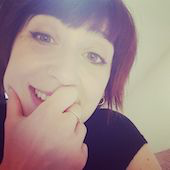
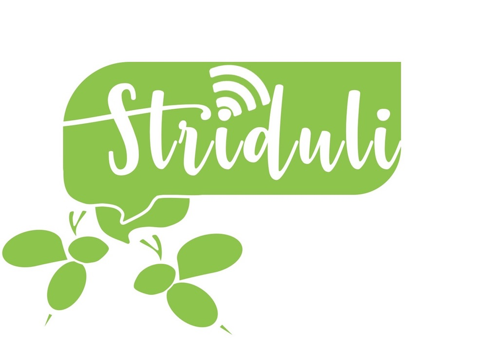

<html>
			<meta charset="utf-8"/>
			<link rel="stylesheet" href="style.css" />
	

	<body>
	

	
		
 Bienvenue sur ma page de présentation de..., et bien de moi même !  
		N'ai pas peur, tu entre en zone contanminé mais si tu prends tes précautions, tout devrait bien se passer. Enfiles ta combinaison de protection, ton masque et suis moi, je vais t'expliquer pourquoi je suis là ! 

		

		
	  <nav>
            <h4> Mes pathogènes préférés</h4>
	    
	    
	    <ol>
                <li><a href="https://www.cdc.gov/vhf/ebola/index.html" target="_blank">le virus Ebola</a></li>
                <li><a href="https://www.cdc.gov/parasites/ascariasis/index.html" target="_blank">Le parasite Ascaris (beurk)</a></li>
                <li><a href="https://www.cdc.gov/tetanus/index.html" target="_blank">La bactérie du tetatnos (qui te plie en deux)</a></li>
		<li><a href="https://www.cdc.gov/leprosy/" target="_blank">La bactérie de la lèpre (tu perds des bouts)</a></li>
            </ol>
        </nav>
	
	
	
		<h2>Qui je suis ?</h2>

	

	Alors ça, c'est une bonne question !   
		 Je suis une jeune maman de 34 ans (oui je sais on ne dirait pas) et je crois que l'on peut dire de moi que je suis une <strong>curieuse</strong>. Comprendre et décortiquer le monde qui nous entoure, c'est un peu une passion. 
		 Curieuse va bien bien avec le monde des sciences et donc j'ai suivi cette voie dans un premier temps puis j'ai (un peu) changé  de vie... 
	  comme tu vas t'en rendre compte au fur et à mesure de cette page, (tu peux télécharger mon cv en cliquant sur ma photo) j'ai choisi un parcourt universitaire tourné vers le monde de l'infiniment petit, j'ai fait pas mal de bénévolat dans l'animation scientifique auprès du grand public et j'ai même monté mon agence d'animation et de communication scientifique. Et c'est cette dernière qui m'a conduite ici.    
	Mais chut! je te laisse découvrir ma page pour en savoir plus.
	

	
	
	
	
	<h2 class= "dessous">Ce que j'ai fait</h2>
	
	

	
 je divise mon parcours en deux parties mais en réalité, elles sont complètement imbriquées (je voulais montrer que je savais faire des listes ;-P ). 
	<ul>
		<li>2003-2007 Bénévole association naturaliste NATRIX, Tours.</li>
		<li>2006-2008 Master d'Infectiologie l'<a href="https://sciences.univ-tours.fr/version-francaise/bienvenue-sur-le-site-de-la-faculte-de-sciences-et-techniques-159428.kjsp" target="_blank"> L'université des sciences et techniques</a>, Tours.</li>
		<li>2007-2008Bénévole <a href="http://www2.cnrs.fr/jeunes/25.htm" target="_blank"> Club CNRS</a>Science pop', Tours.</li>
			<li>2008-2013Doctorat de virologie à l'<a href="http://irbi.univ-tours.fr/" target="_blank"> Institut de Recherche sur la Biologie de l'Insecte</a>, Tours.</li>
			<li>2008-Bénévole et administratrice de l'<a href="http://www.lespetitsdebrouillards.org/" target="_blank">Association les Petits Débrouillards</a>, Tours et Paris.</li>
			<li>2012-2013Attaché temporaire d'enseignement et recherche à l'université de Tours.</li>
			<li>2013-2016Chercheur Contractuel à l'<a href="https://www.pasteur.fr/fr" target="_blank"> Institut Pasteur</a>, Paris.</li>
			
		</ul>
		
	

	

	
	
		<h3> Mon parcours académique</h3>
		
	
 Virus, bactéries, parasites, ils n'ont plus de secret pour moi. A travers mon parcours, j'ai cherché à comprendre comment ils évoluent, se multiplient et infectent un organisme vivant. Ce monde, c'est l'infectiologie !  
	Mes chouchoux: <strong>les virus</strong>, ils sont à l'origine d'un nombre incalculable de polémiques et leurs gènes sont comme un programme informatique: ils codent pour des fonctions dans un environnement bien précis. Leur objectif : se multiplier !      Mon travail de thèse consistait à comprendre comment un virus en particulier se multipliait dans les cellules de son hôte. On appelle ça de la mécanistique virale, ça demande pas mal d'imagination et beaucoup d'abstraction car on travaille avec de l'invisible et on ne peut comprendre qu'indirectement et par déduction comment le virus est codé ! Tu veux en savoir plus ? Ma thèse est <a href="https://www.theses.fr/2013TOUR4037" target="_blank">ici</a>.   
	Après, j'ai enchainé pendant 2 ans à l'Institut Pasteur en travaillant sur un virus de fièvre hémrorragique (non non pas ébola) considéré comme arme bioterroriste potentielle.   Ses petit plus:
	<ul>
		<li> transmis par les moustiques</li>
		<li> transmis par les fluides corporels</li>
		<li> transmis par l'air </li>
		<li> particulièrement tueur chez les bébés animaux</li>
	</ul>
	 
	Voilà, voilà... c'était chouette mais un peu flippant ! 
	

	

		

	<h3> Mon parcours pas académique </h3>
	
	
		
	
Au cours de mes études, j'ai toujours eu à coeur de rester ancrer dans la société ! Le monde de la recherche a un gros défaut, il te coupe souvent de la réalité. On est bien à l'aise dans son labo, avec son sujet de recherche ultra mega précis mais parfois, on peut s'y perdre et on oublie que l'on doit beaucoup à nos contemporains.   On ne communique pas les sciences auprès du grand public, on les questionne, les discute, on leur donne une place (essentielle) dans la société. En tant que citoyen, on participe au débat et en tant que chercheur, on peut apporter un peu de nos connaissances afin de faire avancer le débat.   C'est pour ça que je me suis beaucoup investit auprès des petits débrouillards, cela m'a appris que les savoirs se trouvent partout et que les chercheurs n'ont pas le monopole de la vérité.

		

		

		
	
	
		<h2> Ce que je veux faire </h2>

	
 developpeuse web et blabla bla 

	
	

	<footer>
	

	<figure> </figure>
	<figure> </figure>
	<figure></figure> 
	<figure> 		</figure>				
	
	
	</footer>
	
</body>
</html>
