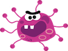

<html>
			<meta charset="utf-8"/>
			<link rel="stylesheet" href="style.css" />
	

	<body>
	

	
		
 Bienvenue sur ma page de présentation de..., et bien de moi même !  
		N'ai pas peur, tu entre en zone contanminée mais si tu prends tes précautions, tout devrait bien se passer. Enfiles ta combinaison de protection, ton masque et suis moi, je vais t'expliquer pourquoi je suis là ! 

		

		
	

	<video src="images/Biosafety.webmsd.webm" controls poster="images/biosafety.png" width="600"></video>
	

	
	
	
		<h2>Qui  je  suis ?</h2>

	

	Alors ça, c'est une bonne question !   
		 Je suis un peu comme tout le monde, plein de choses à la fois ! j'ai une petites filles de 2 ans, je suis curieuse, dynamique, sympa, un peu têtue... bref c'est pas facile d'essayer de se décrire.    
	 Comprendre et décortiquer le monde qui nous entoure, c'est un peu une passion, cette curiosité va bien bien avec le monde des sciences et donc j'ai suivi cette voie dans un premier temps puis j'ai (un peu) changé  de vie... 
	   comme tu vas t'en rendre compte au fur et à mesure de cette page, <strong>(clique sur moi pour télécharger)</strong> j'ai choisi un parcourt universitaire tourné vers le monde de l'infiniment petit, j'ai fait pas mal de bénévolat dans l'animation scientifique auprès du grand public et j'ai même monté mon agence d'animation et de communication scientifique. Et c'est cette dernière qui m'a conduite ici.    
	Mais chut ! Il va falloir continuer pour en savoir plus.
	

	
	
	
	
	<h2 class= "dessous">Ce  que j'ai  fait</h2>
	
	
	  <nav>
            <h4> Mes pathogènes préférés</h4>
	    
	    
	    <ol>
                <li><a href="https://www.cdc.gov/vhf/ebola/index.html" target="_blank">le virus Ebola</a></li>
                <li><a href="https://www.cdc.gov/parasites/ascariasis/index.html" target="_blank">Le parasite Ascaris (beurk)</a></li>
                <li><a href="https://www.cdc.gov/tetanus/index.html" target="_blank">La bactérie du tetatnos (qui te plie en deux)</a></li>
		<li><a href="https://www.cdc.gov/leprosy/" target="_blank">La bactérie de la lèpre (tu perds des bouts)</a></li>
            </ol>
        </nav>
	
	

	
 
	<ul>
		<li>2003-2007 Bénévole association naturaliste NATRIX, Tours.</li>
		<li>2006-2008 Master d'Infectiologie l'<a href="https://sciences.univ-tours.fr/version-francaise/bienvenue-sur-le-site-de-la-faculte-de-sciences-et-techniques-159428.kjsp" target="_blank"> L'université des sciences et techniques</a>, Tours.</li>
		<li>2007-2008Bénévole <a href="http://www2.cnrs.fr/jeunes/25.htm" target="_blank"> Club CNRS</a>Science pop', Tours.</li>
			<li>2008-2013Doctorat de virologie à l'<a href="http://irbi.univ-tours.fr/" target="_blank"> Institut de Recherche sur la Biologie de l'Insecte</a>, Tours.</li>
			<li>2008-Bénévole et administratrice de l'<a href="http://www.lespetitsdebrouillards.org/" target="_blank">Association les Petits Débrouillards</a>, Tours et Paris.</li>
			<li>2012-2013Attaché temporaire d'enseignement et recherche à l'université de Tours.</li>
			<li>2013-2016Chercheur Contractuel à l'<a href="https://www.pasteur.fr/fr" target="_blank"> Institut Pasteur</a>, Paris.</li>
			
		</ul>
		

	

	
	
	
	

	
	
		<h3> Mon parcours académique</h3>
		
	
 
	
	Virus, bactéries, parasites, ils n'ont plus de secret pour moi. A travers mon parcours, j'ai cherché à comprendre comment ils évoluent, se multiplient et infectent un organisme vivant. Ce monde, <em>c'est l'infectiologie </em>!    
	
	Mes chouchoux: <strong>les virus</strong>, ils sont à l'origine d'un nombre incalculable de polémiques et leurs gènes sont comme un programme informatique: ils codent pour des fonctions dans un environnement bien précis. Leur objectif : se multiplier !     
	
	<em>Mon travail de thèse </em> a consisté à décortiquer le mécanisme utiliser par un virus d'insecte pour se multiplier dans les cellules de son hôte. Bon j'imagine que ça ne te parle pas trop mais en gros ça demande pas mal d'imagination et beaucoup d'abstraction. On travaille avec de l'invisible donc autant te dire que tu te torture les méninges pour tenter de comprendre comment ça marche ! Quelle est la fonction de ce gène, pour quoi il code ? A quoi ça sert ?  
	    Je sens que tu veux en savoir plus ! Ma thèse est <a href="https://www.theses.fr/2013TOUR4037" target="_blank">ici</a>.   
	Après, j'ai enchainé pendant 2 ans à l'Institut Pasteur en travaillant sur un virus tueur de bébé animaux. Si tu as bien regardé la vidéo, je travaillais en LVL3 (1:10)   
	Ses petit plus:
	 
	
	
	<ul class= "plus">
		<li> transmis par les moustiques</li>
		<li> transmis par les fluides corporels</li>
		<li> transmis par l'air </li>
		<li> particulièrement tueur chez les bébés animaux</li>
	</ul>

Mon rôle c'était de voir si ce virus pouvait être transmis par les moustiques sur le territoire français. Bon ce virus peut se la jouer un  Ebola et est considéré comme une arme bioterroriste potentielle, alors du coup c'était un peu stress. 

	

	
	
	
	
		

	<h3> Mon parcours pas académique </h3>
	
	
		
	
Je ne sais jamais vraiment comment présenter cette partie. J'aime bien communiquer avec les autres et je trouves que l'on exclut vachement les citoyens des questions scientifiques.    
	Il existe une sorte de condescendance envers les non initiés aux sciences que l'on ne considère pas comme compétents... Je dois avouer que j'étais un peu comme ça quand j'ai commencé à aller vers la médiation scientifique, avec les mêmes préjugés. Puis j'ai renocntré des gens de tous les horizons et j'ai compris une chose importante, que nous avons tous nos façons de penser, la mienne étant plus académique, mais que tous le monde se questionne, pense, réfléchis et est <em>légitime </em>.    
	Les chercheurs n'ont pas le monopole de la vérité, ils apportent un éclairage, peuvent expliquer des phénomènes afin de faciliter la réflexion de tous mais ils sont avant tout citoyen et participent alors aux débats comme vous et moi.   
	Les petits débrouillards, c'est une aventure sociale, humaine, personnelle et professionelle. Nos projets sont tournés vers le numérique, la transition écologique et le vivre ensemble ! 
	
	
	
	   
	 
	  <h3> Nos 3 axes</h3>
	

		

		

		
	
	
		<h2> Ce que je veux faire </h2>

	
 Figures toi que comme les virus, j'évolue !    Depuis plusieurs mois j'ai monté mon agence d'animation scientifique  me permettant de me faire rémunérer lors de mes interventions.   Pour monter et lancer tout ça  je me suis installée à <a href="http://www.pepinieres-agglotours.fr/#pepinieres">la pépinière des Sanitas </a>. J'y ai rencontré plein de gens super sympas et on m'a invité au lancement d'une <a href="https://openagenda.com/paloaltours/events/hitbox-makers-48h-pour-creer-un-jeu">game jam</a> Tours.
	  Honnêtement c'est un milieu que je ne connaissais pas du tout mais je me suis surprise à vouloir en savoir plus, à vouloir même y participer !  
	
 Je me renseigne et prends le temps de la réflexion. J'ai envi d'en savoir plus sur le métier de développeur, si cela me permettra de trouver un emploi intérressant et stable ? Je reçue peu de temps après une proposition de formation de développeur par un organisme de Tours via pôle emploi ! 
   Il fallait que j'aille jusqu'au bout de mes recherches, cette formation me conviendrait-elle ? Sans plus attendre je prend contact avec mon ami Richard afin de lui demander conseil. 
	"STOP ! me dit-il. Pas cette formation !  mais si le métier t'interesse tu peux regarder sur openclassroom, code combat et france IOI. " 
	Je suis bonne élève alors je suis les cours openclassroom, je me renseigne sur le métier et m'inscris à la réunion d'information du cefim. Et très franchement ça me plait, je dois me décrocher de mon ordi en hurlant "non non, encore une petite ligne (de code) "   
	 
	Alors me voilà ! Ma page web un peu simpliste et ma vision artistique est spéciale mais je vais apprendre à faire mieux avec vous, promis !
	

	
	

	<footer>
	

	
 Me suivre sur les réseaux sociaux 

	<figure> </figure>
	<figure> </figure>
	<figure></figure> 
	<figure> 		</figure>				
	
	
	</footer>
	
</body>
</html>
