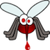

<html>
			<meta charset="utf-8"/>
			<link rel="stylesheet" href="style.css" />
	

<body>
<nav>
		<figure><a href="#parcours">Mon parcours</a></figure>
		<figure><a href="#moi">A propos de moi</a></figure>	
		<figure><a href="#titreprojet">Mon projet</a></figure>	
            	<figure><a href="images/CV FL.pdf" target="_blank">Mon CV</a></figure>
		<figure><a href="https://www.theses.fr/2013TOUR4037" target="_blank">Ma thèse</a></figure>
	 </nav>
	

		
	
	<aside>
		

		
		  
		
		Les métiers du numériques font partis du secteur qui recrute le plus à l'heure actuelle.  
		Il représente une multitudes de métiers d'avenir dont celui de<strong> développeurs web</strong>.  
		C'est un métier passionnant, présentant beaucoup de similitudes avec mes activités précédentes.  
		Il est stimulant, évolue constamment, demande de la persévérance et permet de travailler n'importe où.   C'est pourquoi j'ai fait le choix de me reconvertir dans ce domaine: mon objectif c'est le retour à l'emploi et exercer un métier en évolution permanente. 

	</aside>
	
	
	
	<h2 id="parcours">Mon parcours</h2>
	
	

	   
 <ul>
		<li>2003-2007 Bénévole association naturaliste NATRIX, Tours.</li>
		<li>2006-2008 Master d'Infectiologie<a href="https://sciences.univ-tours.fr/version-francaise/bienvenue-sur-le-site-de-la-faculte-de-sciences-et-techniques-159428.kjsp" target="_blank"> L'université des sciences et techniques</a>, Tours.</li>
		<li>2007-2008 Bénévole <a href="http://www2.cnrs.fr/jeunes/25.htm" target="_blank"> Club CNRS</a> Science pop', Tours.</li>
			<li>2008-2013 Doctorat de virologie à l'<a href="http://irbi.univ-tours.fr/" target="_blank"> Institut de Recherche sur la Biologie de l'Insecte</a>, Tours.</li>
			<li>2008- Bénévole et administratrice de l'<a href="http://www.lespetitsdebrouillards.org/" target="_blank">Association les Petits Débrouillards</a>, Tours et Paris.</li>
			<li>2012-2013 Attaché temporaire d'enseignement et recherche à l'université de Tours.</li>
			<li>2013-2016 Chercheur Contractuel à l'<a href="https://www.pasteur.fr/fr" target="_blank"> Institut Pasteur</a>, Paris.</li>
			<li>2018 Créatrice de l'agence d'animation et de communication scientifique <a href="https://striduli.wixsite.com/striduli" target="_blank"> STRIDULI</a>, Tours.</li>
		</ul>

	

	
	
	
	    <h2 id="moi">A propos de moi</h2>
	    
	    
	

	   
          

		    

	
		<em>Je suis le docteur Faustine LOUIS mais pas le genre de docteur qui soigne, plutôt celui qui s'interesse aux microbes qui te rendent malade. </em>   

		
		<h3>Mes recherches</h3>
		
		

		
Passionnée par le monde de l'invisible, je me suis plongé dans les domaines de la génétique et de l'infectiologie. 
 <strong>Ma thèse: </strong>Mon doctorat à Tours a été passionnant, demandant une grande capacité d'abstraction !  Mon job était de comprendre comment <strong>un virus spécial </strong>est fabriquer dans les cellules d'une guêpe avant d'être injecté avec ses oeufs qu'elle pond dans une chenille. Ce virus empêche la chenille de tuer les larves qui peuvent alors dévorer celle-ci de l'intérieur jusqu'à se transformer en guêpe ... La nature est si belle !    

<strong>Mon postdoc: </strong>J'ai ensuite travailler 2 ans à l'Institut Pasteur de Paris sur un virus de fièvre hémorragique transmis par les moustiques, l'air et les fluides. Là, j'avais la panoplie: combinaison de protection,  masque, gants, lunettes et laboratoire sécurisé. Je devais évaluer si les moustiques français peuvent transmettre ce virus Africain.   

		<h3>Mes loisirs</h3>

 
Je suis très investie dans l'association les petits débrouillards, mouvement d'éducation populaire sensibilisant le grand public aux sciences. C'est important de partager ses connaissances et de discuter sciences avec les enfants et les adultes. J'ai mis en place et participé à de nombreux débats et animations scientifiques. Le numérique fait parti  des grands axes de l'association. Cette aventure me permet d'améliorer ma communication et ma pédagogie mais aussi du recul par rapport à la perception des progrès dans notre société.   

	

	

	
	   

	   
                <h4>Une guêpe en pleine action de parasitisme</h4>
		
 <a href="https://www.youtube.com/watch?v=vMG-LWyNcAs" target="_blank" class="lien"> Body Invaders | National Geographic </a> 

		<video src="images/wasp.webm" controls poster="images/cotesia.jpg" class="centrer" width="200"></video>
		
		<h4>Les Petits Débrouillards</h4>
		
<a href="https://www.youtube.com/watch?v=DgR94p5cf1M&list=FLoTEedbBI6zQ2PW39PB2I2A" target="_blank" class="lien"> Pourquoi devenir un Petit Débrouillard ? </a> 

		<video src="images/pd.webm" controls poster="images/petitsdeb.png" width="200"></video>
            

	
	

	  <h2 id="titreprojet"> Mon Projet</h2>
	  
	  

		   

		   Résoudre des énigmes, c'est ce qui me passionne. En recherche, on se pose une question, on a des outils et pour y répondre, on met en place un protocole de test-erreur et on recommence jusqu'à ce qu'on arrive à répondre à notre questionnement. 

		 
		 <h3> Pourquoi me réorienter ?</h3> 
		  

J'ai une petite fille de 2 ans et je souhaiterais trouver un compromis entre le monde du travail et ma vie de famille.    La recherche, c'est passionnant mais exigeant personnellement. Les postes sont devenus rares et les contrats ne durent pas longtemps. Il faut changer de ville, de pays tous les deux ans, être très disponible, travailler énormément au détriment de tout le reste. J'ai suivi cette voie dans un premier temps puis je fais le choix de changer de métier.  !    
J'ai décidé de faire une pause et de réfléchir à ma situation et mes compétences. j'ai monté mon auto entreprise de communication scientifique tout en réfléchissant à mon projet de reconversion.   L'aventure auto entrepreneur m'a permit de faire des rencontres et de me pencher de façon sérieuse sur le métier de développeur.   Sur les conseils d'amis dans le domaine, j'ai commencé les cours sur <a href="https://openclassrooms.com/" target="_blank">openclassroom</a>, <a href="http://www.france-ioi.org/" target="_blank">France IOI </a>et <a href="https://codecombat.com/" target="_blank">code combat</a>. Me sentant véritablement à l'aise, je suis convaincue que ce métier est fait pour moi et je suis prête à me lancer dans une formation afin d'acquérir les connaissances nécessaire pour proposer mes compétences aux entreprises qui recrutent. 

<h3>Le métier de développeur web</h3>

 Finalement, le métier de développeur n'est pas très loin de ce que je faisais avant. L'environnement change mais pas la façon de faire.     
	 On a une problématique à laquelle il faut répondre. Après avoir bien défini cette problématique on propose une solution semblant la plus appropriée. On met alors en place notre proposition (en labo on appelle ça protocole) à l'aide des outils adaptés puis on teste et on valide nos propositions.   
	 
	 Ce métier nécessite des qualités que j'ai acquises au cours de mon expérience dans la recherche. Je suis autonome et inventive, je me tiens au courant de l'évolutions des outils et sait m'autoformer pour progresser et m'adapter au enjeux de mon métier. 

	 

<h3> La formation</h3>

Je me suis rendue à des réunions d'informations dans plusieurs organismes de formation dont le Cefim.  
	J'ai beaucoup apprécié les détails qui nous ont été fournis sur la formation. Elle dure plus longtemps mais l'alternance de phases d'apprentissage et de phases "projet" me semble être une dynamique très formatrice. Les formateurs sont professionnels et l'accompagnement nous donne toutes nos chances de réussir dans notre entreprise de reconversion. Le réseau de cette école est sans conteste une force, les étudiants peuvent être mis en contact et facilite le retour à l'emploi.   
	<em>Je souhaite vivement pouvoir intégrer cette équipe pour me plonger dans le code, partager nos compétences avec mes collègues en formation, ouvrir mon champ de possibilités et m'insérer harmonieusement dans le monde du travail.</em>   

	

  

	

	<footer>
	

	
 Me suivre sur les réseaux sociaux 

	<figure> </figure>
	<figure> </figure>
	<figure></figure> 
	<figure> 		</figure>				
	
	
	</footer>
	

